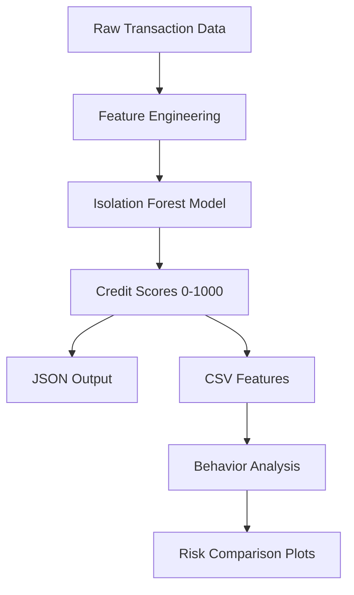

# zeru-assignment

# Wallet Credit Scoring System

This system assigns credit scores (0-1000) to cryptocurrency wallets based on their transaction behavior in the Aave V2 protocol. Higher scores indicate reliable usage, while lower scores suggest risky or exploitative behavior.

## Key Files

1. `zeru.py` - Main processing script
   - Input: `input_transactions.json`
   - Outputs: 
     - `output_scores.json` (credit scores)
     - `wallet_features_scores.csv` (features + scores)

2. `plot.py` - Visualization script
   - Input: `wallet_features_scores.csv`
   - Outputs:
     - `score_distribution.png`
     - `risk_comparison.png`
    
## To Run

### 1. Setup Environment

```bash
git clone https://github.com/saai07/zeru-assignment.git
python -m venv env
source env/bin/activate  # (Windows: env\Scripts\activate)
pip install -r requirements.txt 
```
### 2. Add Input File
- Download the dataset and place the input_transactions.json in the root directory
  
 ### 3. Run Credit Scoring
 ```bash
python zeru.py
 ```
### 4. Run Analysis
 ```bash
python plot.py
```
### 5. Output Files
output_scores.json: Final wallet credit scores

wallet_features_scores.csv: Features + Scores

score_distribution.png, feature_comparison.png: Visuals for reporting

## Methodology

### Algorithm: Isolation Forest
- **Type**: Unsupervised anomaly detection
- **Why chosen**: 
  - Effective for identifying unusual patterns in unlabeled data
  - Handles high-dimensional data well
  - Computationally efficient
- **Mechanism**: 
  - Creates decision trees to isolate anomalies
  - Scores based on path length to isolate observations
  - Higher scores = more normal behavior

### Key Features Engineered
| Feature | Description | Risk Significance |
|---------|-------------|-------------------|
| `repay_ratio` | Repayments / Borrows | Measures debt responsibility |
| `liquidation_ratio` | Liquidations / Borrows | Default risk indicator |
| `utilization` | Net Borrows / Net Deposits | Leverage risk |
| `tx_frequency` | Transactions per day | Bot-like behavior detection |
| `wallet_age` | Days since first transaction | Long-term commitment |
| `time_variance` | Variance between transaction times | Pattern consistency |

## System Architecture


    

